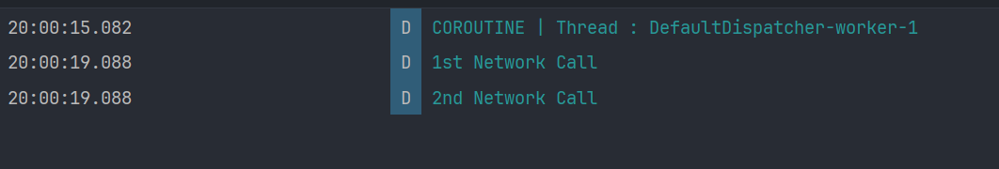

<h1 align="center" >  Android Discovery Lab  <br> ♨ [ ᴀɴᴅʀᴏɪᴅ  ᴘʀᴏᴊᴇᴄᴛ ] ♨</h1>

This repository documents my journey through the Android Developer guidelines using Kotlin. It includes step-by-step instructions, screenshots, and explanations for each unit.

---

<br/>

# Experiment Unit 02: Suspend Functions - Kotlin Coroutines

In this unit, I explored **suspend functions** in Kotlin Coroutines. Suspend functions are a key feature of coroutines that allow us to pause and resume tasks without blocking the main thread. This is especially useful for tasks like network calls or database operations.

<br/>

<div align="center">

</div>

---


#### Key Steps and Learnings:

1. **What are Suspend Functions?**
    - Suspend functions are special functions that can be paused and resumed.
   
    - They can only be called from within a coroutine or another suspend function.
   
    - Example: The `delay` function is a suspend function.


2. **Creating a Suspend Function**:
    - I created a suspend function to simulate a network call:
   
      ```kotlin
      suspend fun doNetworkCall(): String {
          delay(2000L) // Simulate a 2-second network call
          return "1st Network Call"
      }
      ```  
      
    - Another suspend function was created for a second network call:
   
      ```kotlin
      suspend fun doAnotherNetworkCall(): String {
          delay(2000L) // Simulate another 2-second network call
          return "2nd Network Call"
      }
      ```  


3. **Calling Suspend Functions in a Coroutine**:
    - Suspend functions can only be called from within a coroutine.
   
    - Example:
      ```kotlin
      fun testSuspendFunctions() {
          GlobalScope.launch {
              Log.d(TAG, "COROUTINE | Thread : ${Thread.currentThread().name}")
 
              val networkCallOne = doNetworkCall()
              val networkCallTwo = doAnotherNetworkCall()
 
              Log.d(TAG, networkCallOne)
              Log.d(TAG, networkCallTwo)
          }
      }
      ```  


4. **Observing the Behavior**:
    - When the coroutine runs, it logs:
        - The thread it’s running on (e.g., `DefaultDispatcher-worker-1`).
      
        - The results of the two network calls after a total delay of 4 seconds.
      
    - Logs:
      


5. **Key Points About Suspend Functions**:
    - **Non-blocking**: Suspend functions like `delay` pause the coroutine without blocking the thread.
   
    - **Sequential Execution**: If suspend functions are called one after another, their delays add up.
   
    - **Coroutine-Only**: Suspend functions cannot be called outside of a coroutine or another suspend function.

---

#### Code Example:

```kotlin
fun testSuspendFunctions() {
    GlobalScope.launch {
        Log.d(TAG, "COROUTINE | Thread : ${Thread.currentThread().name}")

        val networkCallOne = doNetworkCall()
        val networkCallTwo = doAnotherNetworkCall()

        Log.d(TAG, networkCallOne)
        Log.d(TAG, networkCallTwo)
    }
}

suspend fun doNetworkCall(): String {
    delay(2000L) // Simulate a 2-second network call
    return "1st Network Call"
}

suspend fun doAnotherNetworkCall(): String {
    delay(2000L) // Simulate another 2-second network call
    return "2nd Network Call"
}
```

---

#### Key Takeaways:
- **Suspend functions** are essential for performing long-running tasks in coroutines without blocking the main thread.

- They can only be called from within a coroutine or another suspend function.

- Suspend functions like `delay` are non-blocking, making them ideal for tasks like network calls or database operations.

---
