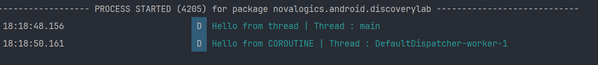

<h1 align="center" >  Android Discovery Lab  <br> ♨ [ ᴀɴᴅʀᴏɪᴅ  ᴘʀᴏᴊᴇᴄᴛ ] ♨</h1>

This repository documents my journey through the Android Developer guidelines using Kotlin. It includes step-by-step instructions, screenshots, and explanations for each unit.

---

<br/>

# Experiment Unit 01: Kotlin Coroutines
In this unit, I explored Kotlin Coroutines to understand how they simplify asynchronous programming in Android. The goal was to learn how coroutines can handle background tasks efficiently without blocking the main thread, making apps faster and more responsive.

<br/>

<div align="center">

</div>

---

## I - Simple Explanation of Kotlin Coroutines:


1. **What are Coroutines?**
    - Coroutines are like **mini-workers** that can do tasks in the background without blocking the main app.
    - Example: Imagine you’re cooking (main task) and need to boil water (background task). A coroutine is like a helper who boils water while you keep cooking.


2. **Why Use Coroutines?**
    - In Android apps, everything usually happens on the **main thread** (like updating the screen). If you do a long task (like downloading data) on the main thread, the app freezes.
    - Example: If you’re watching a video and the app freezes because it’s loading a big file, that’s annoying. Coroutines fix this by doing the loading in the background.


3. **How are Coroutines Different from Threads?**
    - **Threads** are like heavy workers. Too many can slow down or crash your app.
    - **Coroutines** are lightweight. You can have thousands of them without crashing the app.
    - Example: Running 100,000 threads crashes the app, but 100,000 coroutines work fine.


4. **Cool Features of Coroutines**:
    - **Pause and Resume**: Coroutines can stop in the middle of a task and continue later.
        - Example: Like pausing a game, doing something else, and then resuming the game.
    - **Switch Threads**: A coroutine can start in one thread and move to another.
        - Example: A worker starting in the kitchen (main thread) and moving to the garden (background thread) to finish a task.


5. **Why Learn Coroutines?**
    - They make your app faster and smoother.
    - They’re easy to use for tasks like downloading data, reading files, or updating the database.


#


### Example in Real Life:
Imagine you’re running a coffee shop:
- **Main Thread**: You’re taking orders and serving coffee.
- **Coroutine**: Your helper is grinding coffee beans in the background while you keep serving customers.
- If you didn’t have a helper (coroutine), you’d have to grind the beans yourself, and customers would wait longer.

<br/>

---

<br/>

## II - Launching Your First Coroutine

I learned how to launch my first Kotlin Coroutine in an Android app. The goal was to understand the basics of coroutines, including how to set them up, run them in the background, and observe their behavior compared to the main thread.


### Experiment Unit 02: Launching Your First Coroutine

In this unit, I learned how to launch my first **Kotlin Coroutine** in an Android app. The goal was to understand the basics of coroutines, including how to set them up, run them in the background, and observe their behavior compared to the main thread.

---

#### Key Steps and Learnings:

1. **Adding Coroutine Dependencies**:
    - Coroutines are not included in Kotlin by default, so I added the necessary dependencies in the `build.gradle` file:
      ```gradle
      dependencies {
          implementation "org.jetbrains.kotlinx:kotlinx-coroutines-core:1.9.0"
          implementation "org.jetbrains.kotlinx:kotlinx-coroutines-android:1.9.0"
      }
      ```  
    - After syncing the project, I was ready to use coroutines.


2. **Launching a Coroutine with `GlobalScope`**:
    - I used `GlobalScope.launch` to start a coroutine. This is the simplest way to launch a coroutine, but it’s **not the best practice** (more on this in later units).
    - `GlobalScope` means the coroutine lives as long as the app does. If the app is closed, the coroutine is canceled.


3. **Running Code in a Coroutine**:
    - Inside the `launch` block, I added code to log which thread the coroutine is running on:
      ```kotlin
      GlobalScope.launch {
          Log.d(TAG, "Hello from COROUTINE | Thread : ${Thread.currentThread().name}")
      }
      ```  
    - For comparison, I also logged a message from the main thread:
      ```kotlin
      Log.d(TAG, "Hello from thread | Thread : ${Thread.currentThread().name}")
      ```  
👉 [View the code here `MainActivity`](./app/src/main/java/novalogics/android/discoverylab/MainActivity.kt)


4. **Observing Thread Behavior**:
    - When I ran the app, the logs showed:
        - `Hello from thread | Thread : main` (main thread).
        - `Hello from COROUTINE | Thread : DefaultDispatcher-worker-1` (background thread).
    - This confirmed that the coroutine runs on a separate thread, not blocking the main thread.

5. **Using `delay` to Suspend a Coroutine**:
    - Coroutines can be paused using the `delay` function, which is non-blocking.
    - Example:
      ```kotlin
      GlobalScope.launch {
          delay(2000L) // Pause for 2 seconds
          Log.d(TAG, "Hello from COROUTINE | Thread : ${Thread.currentThread().name}")
      }
      ```  
    - Unlike `Thread.sleep`, `delay` only pauses the coroutine, not the entire thread.

        

6. **Coroutine Cancellation**:
    - If the main thread finishes (e.g., the app is closed), all coroutines are canceled, even if they are still running.
    - Example: Increasing the delay to 5 seconds and closing the app before the coroutine finishes:
        - The log message from the coroutine is never printed because the coroutine is canceled when the app closes.

#

#### Key Takeaways:
- **Coroutines are lightweight**: They run on background threads without blocking the main thread.
- **`delay` is non-blocking**: It only pauses the coroutine, not the entire thread.
- **Coroutines depend on the main thread**: If the main thread finishes, all coroutines are canceled.


---
