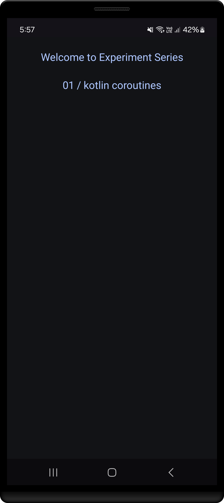

<h1 align="center" >  Android Discovery Lab    ♨ [ ᴀɴᴅʀᴏɪᴅ  ᴘʀᴏᴊᴇᴄᴛ ] ♨</h1>

This repository documents my journey through the Android Developer guidelines using Kotlin. It includes step-by-step instructions, screenshots, and explanations for each unit.

---

## Unit 1: First Android Project (Using Jetpack Compose)
In this unit, I created my first Android project using Android Studio. The goal was to familiarize myself with the Android development environment, project structure, and basic concepts like activities, layouts, and the Android Manifest.

---

### Steps by Step

#### 1. Launch Android Studio
- Double-click the Android Studio icon to launch the IDE.

#### 2. Create a New Project
- In the **Welcome to Android Studio** dialog, click **New Project**.  
  

#### 3. Select a Project Template
- The **New Project** window opens with a list of templates provided by Android Studio.
- Ensure the **Phone and Tablet** tab is selected.
- Click the **Empty Activity** template to select it as the template for your project.
- Click **Next**.  
  

#### 4. Configure Your Project
- In the **New Project** dialog, configure your project as follows:
    - **Name**: Enter the name of your project, e.g., `AndroidProject`
        - Use **PascalCase** for project names (e.g., `MyFirstApp`)
    - **Package Name**: This is a unique identifier for your app, typically in the format `com.example.appname`.
        - Example: `com.example.androidproject`
        - The package name is used to uniquely identify your app on the Google Play Store and in the Android ecosystem.
    - **Save Location**: Leave this field as the default or choose a custom location on your computer.
    - **Language**: Select **Kotlin**.
    - **Minimum SDK**: Select **API 24: Android 7.0 (Nougat)**.
        - The Minimum SDK indicates the oldest version of Android your app will support.  
          

#### 5. Finish and Wait for Setup
- Click **Finish**.
- Android Studio will set up your project. This may take a few minutes.

#### 6. Explore the Android Studio Interface
- Once the project is set up, click **Split** on the top right of Android Studio. This allows you to view both the code and design simultaneously.
    - You can also switch between **Code** (code-only view) and **Design** (design-only view).
- The interface is divided into three main areas:
    1. **Project View**: Displays the files and folders of your project.
    2. **Code View**: Where you write and edit your Kotlin or XML code.
    3. **Design View**: A preview of your app’s layout.  
       

---

### Key Concepts

#### Project Structure
- **`app/src/main/java`**: Contains the Kotlin source code for your app.
- **`app/src/main/res`**: Contains resources like layouts (`layout/`), drawables (`drawable/`), and values (`values/`).
- **`AndroidManifest.xml`**: Defines the app’s components (e.g., activities) and permissions.

#### Empty Activity Template
- The **Empty Activity** template creates a single screen (activity) with a basic layout (`activity_main.xml`) and a corresponding Kotlin file (`MainActivity.kt`).

#### Minimum SDK
- Choosing **API 24: Android 7.0 (Nougat)** ensures your app can run on devices with Android 7.0 and above.

---

### Next Steps
- Explore the `MainActivity.kt` file to understand how Kotlin is used to define app behavior.
- Modify the `activity_main.xml` file to customize the app’s layout.
- Run the app on an emulator or physical device to see it in action.

---

This `README.md` is now complete and adheres to standard documentation practices. Feel free to expand it further as you progress through the course!
